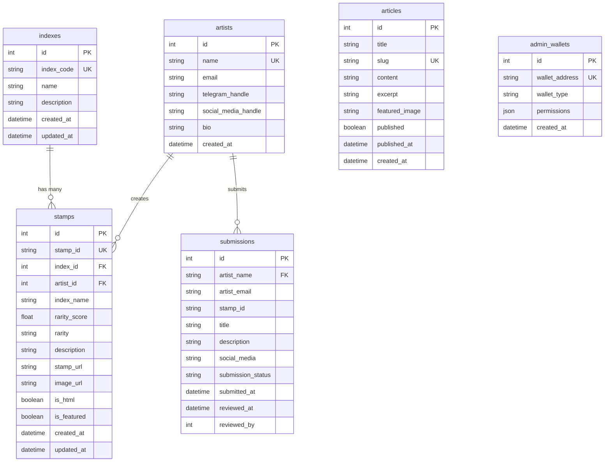

# Database Schema Documentation

## Overview
This document describes the database schema for the NSID (Bitcoin STAMP Index) application. The system uses PostgreSQL with Prisma ORM for database management.

## Entity Relationship Diagram

## Table Descriptions

### 1. indexes
Stores information about curated stamp collections or indexes.

| Column | Type | Constraints | Description |
|--------|------|-------------|-------------|
| id | INTEGER | PRIMARY KEY, AUTO_INCREMENT | Unique identifier |
| index_code | VARCHAR | UNIQUE, NOT NULL | Index code (e.g., 'Index01') |
| name | VARCHAR | NOT NULL | Display name of the index |
| description | TEXT | NULLABLE | Detailed description |
| created_at | TIMESTAMP | DEFAULT NOW() | Creation timestamp |
| updated_at | TIMESTAMP | AUTO UPDATE | Last update timestamp |

### 2. artists
Contains artist profiles and information.

| Column | Type | Constraints | Description |
|--------|------|-------------|-------------|
| id | INTEGER | PRIMARY KEY, AUTO_INCREMENT | Unique identifier |
| name | VARCHAR | UNIQUE, NOT NULL | Artist name |
| email | VARCHAR | NULLABLE | Contact email |
| telegram_handle | VARCHAR | NULLABLE | Telegram username |
| social_media_handle | VARCHAR | NULLABLE | Social media handle |
| bio | TEXT | NULLABLE | Artist biography |
| created_at | TIMESTAMP | DEFAULT NOW() | Registration timestamp |

### 3. stamps
Core table storing Bitcoin STAMP information.

| Column | Type | Constraints | Description |
|--------|------|-------------|-------------|
| id | INTEGER | PRIMARY KEY, AUTO_INCREMENT | Unique identifier |
| stamp_id | VARCHAR | UNIQUE, NOT NULL | Bitcoin STAMP ID |
| index_id | INTEGER | FOREIGN KEY | Reference to indexes table |
| artist_id | INTEGER | FOREIGN KEY, NULLABLE | Reference to artists table |
| index_name | VARCHAR | NULLABLE | Formatted name (e.g., 'Naka_Index01_STAMP01') |
| rarity_score | FLOAT | NULLABLE | Calculated rarity score |
| rarity | VARCHAR | NULLABLE | Rarity tier/classification |
| description | TEXT | NULLABLE | Stamp description |
| stamp_url | VARCHAR | NULLABLE | URL to stamp resource |
| image_url | VARCHAR | NULLABLE | URL to stamp image |
| is_html | BOOLEAN | NULLABLE | Whether stamp is HTML content |
| is_featured | BOOLEAN | DEFAULT FALSE | Featured flag |
| created_at | TIMESTAMP | DEFAULT NOW() | Creation timestamp |
| updated_at | TIMESTAMP | AUTO UPDATE | Last update timestamp |

### 4. submissions
Tracks artist submissions for review.

| Column | Type | Constraints | Description |
|--------|------|-------------|-------------|
| id | INTEGER | PRIMARY KEY, AUTO_INCREMENT | Unique identifier |
| artist_name | VARCHAR | NOT NULL | Submitter name |
| artist_email | VARCHAR | NOT NULL | Submitter email |
| stamp_id | VARCHAR | NULLABLE | Associated stamp ID |
| title | VARCHAR | NOT NULL | Submission title |
| description | TEXT | NOT NULL | Submission description |
| social_media | VARCHAR | NULLABLE | Social media info |
| submission_status | VARCHAR | DEFAULT 'pending' | Status: pending/approved/rejected |
| submitted_at | TIMESTAMP | DEFAULT NOW() | Submission timestamp |
| reviewed_at | TIMESTAMP | NULLABLE | Review timestamp |
| reviewed_by | INTEGER | NULLABLE | Reviewer admin ID |

### 5. articles
Content management for articles/blog posts.

| Column | Type | Constraints | Description |
|--------|------|-------------|-------------|
| id | INTEGER | PRIMARY KEY, AUTO_INCREMENT | Unique identifier |
| title | VARCHAR | NOT NULL | Article title |
| slug | VARCHAR | UNIQUE, NOT NULL | URL-friendly slug |
| content | TEXT | NOT NULL | Article content |
| excerpt | TEXT | NULLABLE | Short summary |
| featured_image | VARCHAR | NULLABLE | Featured image URL |
| published | BOOLEAN | DEFAULT FALSE | Publication status |
| published_at | TIMESTAMP | NULLABLE | Publication timestamp |
| created_at | TIMESTAMP | DEFAULT NOW() | Creation timestamp |

### 6. admin_wallets
Stores admin wallet addresses for authentication.

| Column | Type | Constraints | Description |
|--------|------|-------------|-------------|
| id | INTEGER | PRIMARY KEY, AUTO_INCREMENT | Unique identifier |
| wallet_address | VARCHAR | UNIQUE, NOT NULL | Bitcoin/Lightning wallet address |
| wallet_type | VARCHAR | NOT NULL | Wallet type: bitcoin/lightning |
| permissions | JSON | NULLABLE | Admin permissions object |
| created_at | TIMESTAMP | DEFAULT NOW() | Creation timestamp |

## Relationships

1. **indexes ↔ stamps**: One-to-Many
   - An index can contain multiple stamps
   - Each stamp belongs to one index

2. **artists ↔ stamps**: One-to-Many
   - An artist can create multiple stamps
   - Each stamp can have one artist (optional)

3. **artists ↔ submissions**: One-to-Many
   - An artist can make multiple submissions
   - Each submission is linked to one artist by name

## Indexes and Constraints

- **Primary Keys**: All tables use auto-incrementing integer IDs
- **Unique Constraints**:
  - indexes.index_code
  - artists.name
  - stamps.stamp_id
  - articles.slug
  - admin_wallets.wallet_address
- **Foreign Keys**:
  - stamps.index_id → indexes.id
  - stamps.artist_id → artists.id
  - submissions.artist_name → artists.name

## Notes

- The database uses PostgreSQL-specific features like JSON fields
- Timestamps use PostgreSQL's automatic timestamp handling
- All table names are pluralized and use snake_case
- Column names use snake_case for database fields
- Prisma maps these to camelCase in the application layerr
